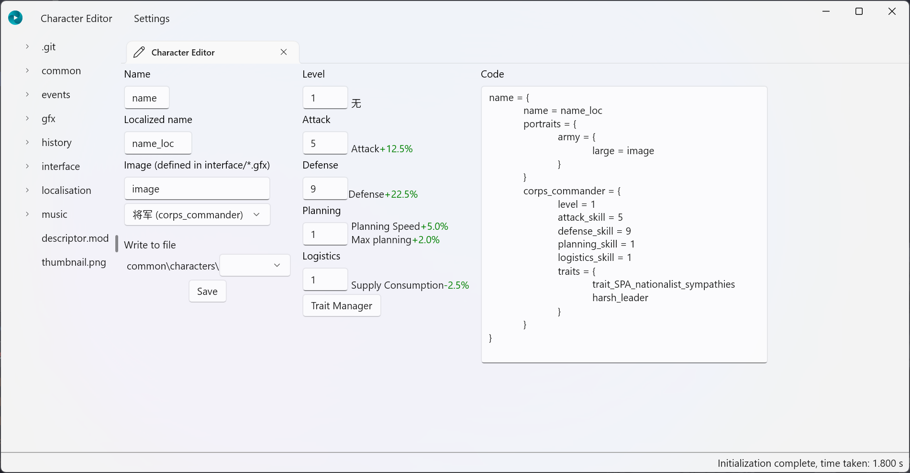
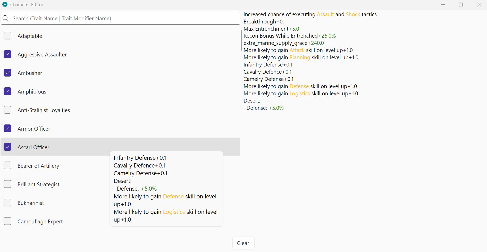

<h1 align="center">
    Moder
</h1>

Moder 是 HOI4 (钢铁雄心4) 的可视化编辑器, 用于简化 Mod 开发

## 运行环境要求

- Windows 10 1809 - Build 1776 及以上的版本

## 安装

点击此链接下载 [Moder](https://github.com/textGamex/Moder/releases)  
解压后点击 Moder.Core.exe 运行

## 功能

- State 文件编辑
- 人物编辑器 (WIP)

## 截图

人物编辑器

State 文件编辑

